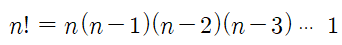
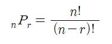
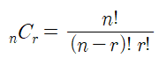
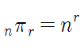
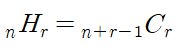
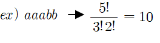
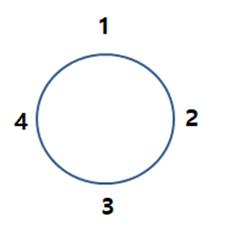

팩토리얼
서로 다른 n개를 나열하는 경우의 수

순열 
**서로 다른 n개중에 r개를 선택하는 경우의 수**(**순서 상관 있음**)

조합

**서로 다른 n개중에 r개를 선택하는 경우의 수** (**순서 상관 없음**)

중복 순열

**중복 가능한 n개중에서 r개를 선택하는 경우의 수** (**순서 상관 있음**)

중복 조합

**중복 가능한 n개중에서 r개를 선택하는 경우의 수**

같은 것이 있는 순열

 **같은 것이 포함된 원소들을 나열하는 경우의 수**

원 순열

 **원 모양의 테이블에 n개의 원소를 나열하는 하는 경우의 수**

