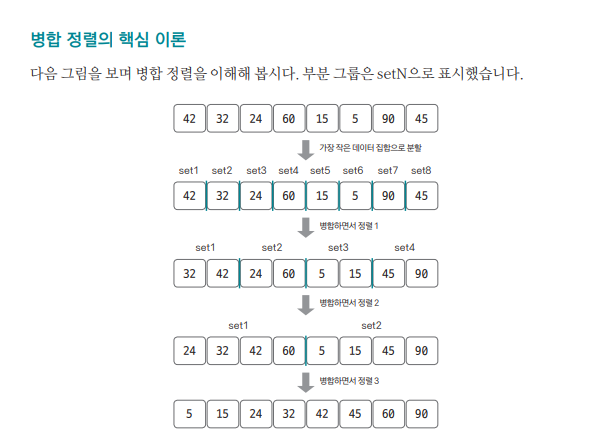
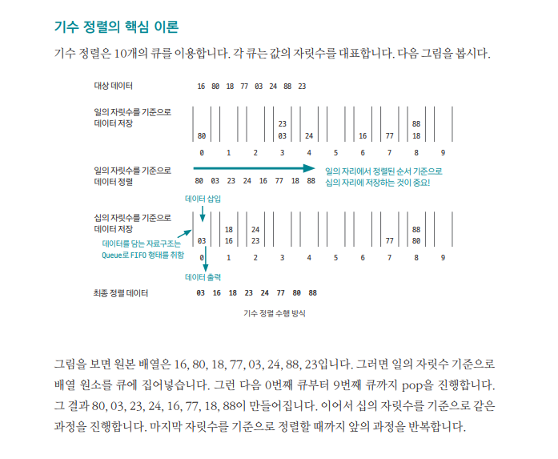

## 정렬

### 버블 정렬

데이터의 인접 요소끼리 비교하고, swap연산을 수행하며 정렬하는 방식
구현이 간단할 순 있지만, 시간 복잡도는 O(N**2)으로 다른 정렬 알고리즘보다 속도가 느린편

버블 정렬의 과정

1. 비교 연산이 필요한 루프 범위를 설정한다.
2. 인접한 데이터 값을 비교한다.
3. swap 조건에 부합하면 swap 연산을 수행한다.
4. 루프 범위가 끝날 때까지 2~3을 반복한다.
5. 정렬 영역을 설정한다. 다음 루프를 실행할 때는 이 영역을 제외한다.
6. 비교 대상이 없을 때까지 1~5를 반복한다.

만약 특정한 루프의 전체 영역에서 swap이 한 번도 발생하지 않았다면 그 영역 뒤에 있는 데이터가 모두 정렬됐다는 뜻이므로 프로세스를 종료해도 됩니다.

### 선택 정렬

대상 데이터에서 최대나 최소데이터를 나열된 순으로 찾아가며 선택하는 방법

구현이 복잡하고 시간 복잡도도 O(N**2)으로 효율적이지 않아 코딩 테스트에서 많이 사용하지 않습니다.

최솟값 또는 최댓값을 찾고, 남은 정렬 부분의 가장 앞에 있는 데이터와 swqp하는 것이 선택 정렬의 핵심.

선택 정렬의 과정

1. 남은 정렬 부분에서 최솟값 또는 최댓값을 찾는다.
2. 남은 정렬 부분에서 가장 앞에 있는 데이터와 선택된 데이터를 swap한다.
3. 가장 앞에 있는 데이터의 위치를 변경해(index++) 남은 정렬 부분의 범위를 축소한다.
4. 전체 데이터 크기만큼 index가 커질 때까지, 즉 남은 정렬 부분이 없을 때까지 반복한다.

선택 정렬 자체를 묻는 코딩 테스트 문제는 잘 나오지 않지만, 이 원리를 응용하는 문제는 나올 수 있으므로 선택 정렬이 어떤 원리로 작동하는지는 알아둘 필요가 있다.

### 삽입 정렬

이미 정렬된 데이터 범위에 정렬되지 않은 데이터를 적절한 위치에 삽입시켜 ㅈ정렬하는 방식

시간 복잡도는 O(N**2)으로 느린편이지만 구현하기 쉬움.

선택 데이터를 현재 정렬된 데이터 범위 내에서 적절한 위치에 삽입하는 것이 핵심

삽입 정렬의 과정

1. 현재 index에 있는 데이터 값을 선택한다.
2. 현재 선택한 데이터가 정렬된 데이터 범위에 삽입될 위치를 탐색한다.
3. 삽입 위치부터 index에 있는 위치까지 shift 연산을 수행한다.
4. 삽입 위치에 현재 선택한 데이터를 삽입하고 index++ 연산을 수행한다.
5. 전체 데이터의 크기만큼 index가 커질 때까지, 즉 선택할 데이터가 없을 때까지 반복한다.
   - 적절한 삽입 위치를 탐색하는 부분에서 이진 탐색 등과 같은 탐색 알고리즘을 사용하면 시간 복잡도를 줄일 수 있다.

### 퀵 정렬

기준값을 선정해 해당 값보다 작은 데이터와 큰 데이터로 분류하는 것을 반복해 정렬하는 알고리즘

기준값이 어떻게 선정되는지가 시간 복잡도에 많은 영향을 미치고, 평균적인 시간 복잡도는 O(nlogn)이지만 최악의 경우 O(N**2)의 시간 복잡도를 가짐.

pivot을 중심으로 계속 데이터를 2개의 집합으로 나누면서 정렬하는 것이 핵심

퀵 정렬의 과정

1. 데이터를 분할하는 pivot을 설정
2. pivot을 기준으로 다음 들여쓴 1~5과정을 거쳐 데이터를 2개의 집합으로 분리
   1. start가 가리키는 데이터가 pivot이 가리키는 데이터보다 작으면 start를 오른쪽으로 1칸 이동
   2. end가 가리키는 데이터가 pivot이 가리키는 데이터보다 크면 end를 왼쪽으로 1칸 이동
   3. start가 가리키는 데이터가 pivot이 가리키는 데이터보다 크고, end가 가리키는 데이터가 pivot이 가리키는 데이터보다 작으면 start, end가 가리키는 데이터를 swap하고 start는 오른쪽, end는 왼쪽으로 1칸씩 이동
   4. start와 end가 만날 때까지 1~3 반복
   5. start와 end가 만나면 만난 지점에서 가리키는 데이터와 pivot이 카리키는 데이터를 비교하여 pivot이 가라키는 데이터가 크면 만난 지점의 오른쪽에, 작으면 만난 지점의 왼쪽에 pivot이 가리키는 데이터를 삽입.
3. 분리 집합에서 각각 다시 pivot을 선정
4. 분리 집합이 1개 이하가 될 때까지 과정 1~3을 반복

### 병합 정렬

분할 정복 방식을 사용해 데이터를 분할하고 분할한 집합을 정렬하며 합치는 알고리즘

시간 복잡도는 O(nlogn)

 

2개 그룹을 병합하는 과정

투 포인터 개념을 사용하여 왼쪽, 오른쪽 그룹을 병합. 왼쪽 포인터와 오른쪽 포인터의 값을 비교하여 작은 값을 결과 배열에 추가하고 포인터를 오른쪽으로 1칸 이동.

**이 방식은 여러 문제에서 응용하므로 반드시 숙지 필요**

### 기수 정렬

값을 비교하지 않는 특이한 정렬

값을 놓고 비교할 자릿수를 정한 다음 해당 자릿수만 비교

시간 복잡도는 O(kn), k는 자릿수

기수 정렬은 정렬중 시간 복잡도가 가장 짧음.

### 계수 정렬

수를 비교하지 않고 각 수가 몇 개 씩 나오는지 세어주는 정렬

Օ(n+데이터의 최대값 k)의 속도가 보장되는 정렬
