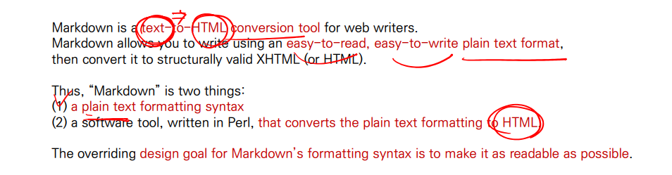
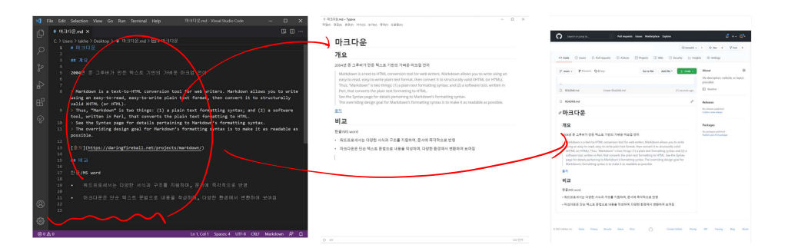
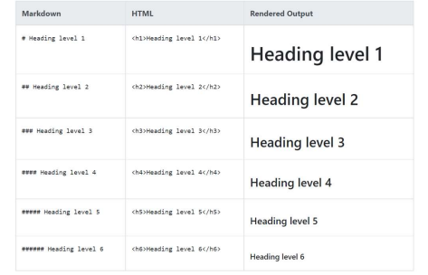

# Markdown

## 마크다운 사용법 및 실습


## 마크다운 개요

- 2004년 존 그루버가 만든 텍스트 기반의 가벼운 **마크업 언어**
- 최초 마크다운에 비해 확장된 문법(표, 주석 등)이 있지만, 본 수업에서는 Github에서 사용 가능한 문법(Github Flavored Markdown)을 기준으로 설명



### 마크 다운 특징

- 워드 프로세서(한글/ MS word)는 다양한 서식과 구조를 지원하며, 문서에 **즉각적**으로 반영
- 마크다운은 가능한 읽을 수 있도록 최소한의 문법으로 구조화 (make it as readable as possible)
- 마크 다운은 단순 텍스트 문법으로 내용을 작성하며, 다양한 환경에서 변환하여 보여짐
  - 다양한 text editor, 웹 환경에서 모두 지원



### 마크다운 활용 예 - README.md

- Github 등의 사이트에서는 **파일명이 *README.md***인 것을 모두 보여줌
  -  오픈 소스의 공식 문서를 작성하거나 개인 프로젝트의 프로젝트 소개서로 활용
  - 혹은 모든 페이지에 README.md를 넣어 문서를 바로 볼 수 있도록 활용
- 다양한 기술블로그에서는 **정적사이트생성기(Static site generator)**
  -  *Jekyll, Gatsby, Hugo, Hexo* 등을 통해 작성된 마크다운을 HTML, CSS, JS 파일 등으로 변환하고
  - Github pages 기능을 통해 호스팅 (외부 공개)


### 마크 다운 활용 예 - 기타

- 다양한 개발 환경 뿐만 아니라 일반 SW에서도 많이 사용되고 있음
  - *Jupyter notebook*에는 별도의 마크다운 셀이 있어, 데이터 분석 등을 하는 과정에서 프로젝트 내용과 분석 결과를 정리함
  - Notion과 같은 메모/노트 필기 SW에서도 기본 문법으로 **마크다운**을 채택


### 마크다운 문법 - Heading

- Heading은 문서의 제목이나 소제목으로 사용
  - #의 개수에 따라 대응되는 수준(Heading level)이 있으며, h1 ~ h6까지 표현 가능
  - 문서의 구조를 위해 작성되며 글자 크기를 조절하기 위해 사용되어서는 안됨

| Do this            | Don't do this     |
| ------------------ | ----------------- |
| # Here's a Heading | #Here's a Heading |


### 마크다운 문법 - list

- List는 순서가 있는 리스트(ol)와 순서가 없는 리스트(ul)로 구성


### 마크다운 문법 - Fencced Code block

- 코드 블록은 backtick 기호 3개를 활용하여 작성(\``` ```)
- 코드 블록에 특정 언어를 명시하면 Syntax Highlighting 적용 가능
  -  일부 환경에서는 적용이 되지 않을 수 있음


### 마크다운 문법 - Inline Code block

- 코드 블록은 backtick 기호 1개를 인라인에 활용하여 작성(``)


### 마크다운 문법 - Link

- [문자열] (url)을 통해 링크를 작성 가능
  - 특정 파일들 포함하여 연결 시킬 수도 있음


### 마크다운 문법 - 이미지

- ![문자열] (url)을 통해 이미지를 사용 가능
  - 특정 파일들 포함하여 연결 시킬 수도 있음

마크다운 문법 - Blockquotes (인용문)

- '>'를 통해 인용문을 작성 


### 마크다운 문법 - Table (표)

- 표는 아래의 문법을 참고

  - 일부 지원 안되는 환경도 있음

  - | Syntax    | Description |
    | --------- | ----------- |
    | Jeader    | Title       |
    | Paragraph | Text        |


### 마크다운 문법 - text 강조

- **굵게(bold)**, *기울임(ltalic)*을 통해 특정 글자들을 강조


### 마크다운 문법 - 수평선

- 3개 이상의 asterisks (***), dashes (---), or underscores (___)


### 마크다운 관련 자료

- [GitHub Flavored Markdown](https://github.com/gfm/)
- [Mastering Markdown](https://guides.guthub.com/features/mastering-markdown/)
- [Markdown Guide](https://www.marldownguide.org/)


### 개발자에게 문서 작성이란?

- 백엔드 개발자를 꿈꾸는 학생 개발자들에게 (https://d2.naver.com/news/3435170)	
  - 레벨 2 개발자 : '자신이 경험한 사용법을 문서화해서 팀 내에 전파할 수 있음'
- Google Technical Writing (https://developers.google.com/tech-writing)
  - Every engineer is also a writer
- Technical writing conference (https://engineering.linecorp.com/ko/blog/write-the-docs-prague-2018-recap/)
  - Clove 기술 문서 작성 및 관리 업무


## Markdown 실습

- TYPORA를 활용한 문서 작성

### Typora

- 기존 텍스트 에디터 (예-  visual studio code), IDE 뿐만 아니라 마크다운 전용 에디터를 활용하여 문서를 작성할 수 있음
- Typora는 문법을 작성하면 바로 일반적으로보이는 모습으로 변하여 처음 작성할 때 많은 도움을 주며, 표 같은 복잡한 문법이나 이미지를 드래그 앤 드랍으로 적용 가능함.

### Typora Tip

- 이미지는 아래의 설정을 해두면 마크다운 파일이 있는 위치에 md-images 폴더를 만들고, 가능한 이미지들을 모두 복사하여 상대경로로 표현함
  - 상대 경로 예시: ./md-images/untitle.png
  - 절대 경로 예시: C:/HPHK/Desktop/TIL/untitle.png

