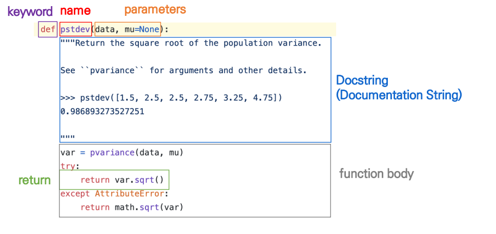
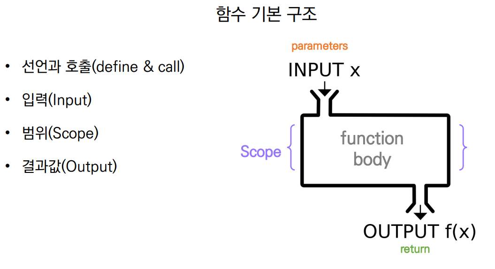
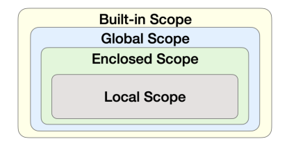

# 함수

## 정의

함수(Function)

- 특정한 기능을 하는 코드의 조각(묶음)
- 특정 명령을 수행하는 코드를 매번 다시 작성하지 않고, 필요시에만 호출하여 간편히 사용

사용자 함수(Custom Function)

- 구현되어 있는 함수가 없는 경우, 사용자가 직접 함수를 작성 가능

```python
def function_name(parameter):
# code block
return returning_value
```


함수를 사용해야 하는 이유

- 코드 중복 방지 
- 재사용 용이







선언과 호출

- 함수의 선언은 def 키워드를 활용
- 들여쓰기를 통해 Function body(실행될 코드블록)를 작성
  - Docstring은 함수 body 앞에 선택적으로 작성 가능
    - 작성시에는 반드시 첫 번째 문장에 문자열 '''
- 함수는 parameter를 넘겨줄 수 있음
- 함수는 작동 후 return을 통해 결과값을 전달함
- 함수는 함수명()으로 호출
  - parameter가 있는 경우, 함수명(값1, 값2, ...)로 호출


**함수는 호출되면 코드를 실행하고 return 값을 반환하며 종료된다.**


## 함수의 결과


### return

- 함수는 반드시 값을 하나만 return한다.

  - 명시적인 return이 없는 경우에도 None을 반환한다.

- 함수는 return과 동시에 실행이 종료된다.

  #return 이 여러번 작성되어 있을시 첫번째 return을 실행하고 종료됨.
  
  ```python
  def minus_and_product(x, y):
  return x - y, x * y
  print(minus_and_product(x, y))
  위와 같이 입력시 여러 결과값을 받으면 (x - y, x * y)값이 튜플로 도출된다.
  ```
  
  

​	

return은 함수안에서 값을 반환하기 위해 사용

print는 출력을 위해 사용


### 함수의 입력

- Parameter : 함수를 실행할 때, 함수 내부에서 사용되는 식별자  
- Argument : 함수를 호출 할 때, 넣어주는 값

```python
def function(ham): # parameter : ham
return ham
function('spam') # argument: 'spam
```


Argument란? 

- 함수 호출 시 함수의 parameter를 통해 전달되는 값 
- Argument는 소괄호 안에 할당 func_name(argument) 
  - 필수 Argument : 반드시 전달되어야 하는 argument 
  - 선택 Argument : 값을 전달하지 않아도 되는 경우는 기본 값이 전달


# 함수의 범위 (Scope)

- 함수는 코드 내부에 local scope를 생성하며, 그 외의 공간인 global scope로 구분 
- scope 
  - global scope : 코드 어디에서든 참조할 수 있는 공간 
  - local scope : 함수가 만든 scope. 함수 내부에서만 참조 가능 
- variable 
  - global variable : global scope에 정의된 변수 
  - local variable : local scope에 정의된 변수


객체 수명주기

- 객체는 각자의 수명주기(lifecycle)가 존재
  - built-in scope
    - 파이썬이 실행된 이후부터 영원히 유지
  - global scope
    - 모듈이 호출된 시점 이후 혹은 인터프리터가 끝날 때까지 유지
  - local scope
    - 함수가 호출될 때 생성되고, 함수가 종료될 때까지 유지





함수의 입력

| 단어      | 번역           | 의미                                 |
| --------- | -------------- | ------------------------------------ |
| Parameter | 매개변수       | 함수와 메서드 입력 변수(Variable) 명 |
| Argument  | 전달인자, 인자 | 함수와 메서드의 입력 값(Value)       |


sep (' ')

여러개를 동시에 출력할 때 사이에 구분값

end ('\n')

print 출력이 된 이후 뒤에 뭐를 붙일지를 나타냄
