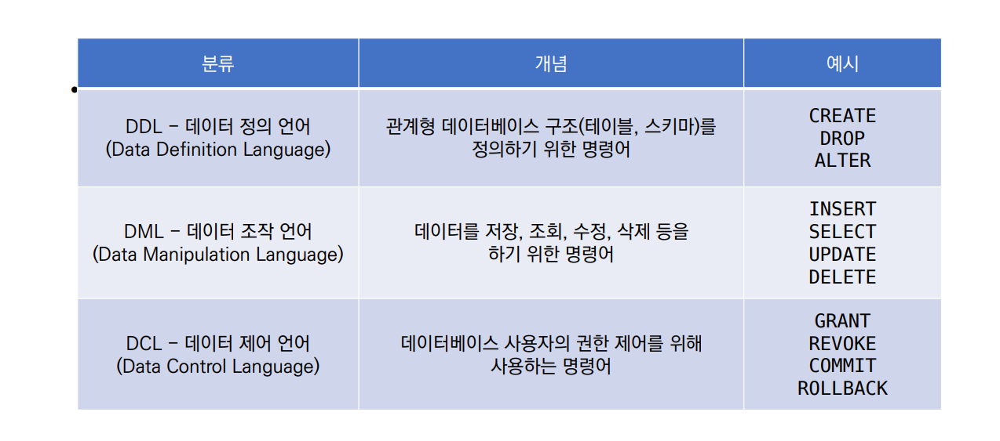

# Database

- 데이터 베이스는 **체계화된 데이터**의 모임
- 여러 사람이 공유하고 사용할 목적으로 통합 관리되는 정보의 집합
- 논리적으로 연관된 (하나 이상의) 자료의 모음으로 그 내용을 고도로 구조화 함으로써 검색과 갱신의 효율화를 꾀한 것
- 몇 개의 자료 파일을 **조직적으로 통합**하여 자료 **항목의 중복을 없애고 자료를 구조화하여 기억** 시켜 놓은 자료의 집합체

### 장점

- 데이터 중복 최소화
- 데이터 무결성 (정확한 정보를 보장)
- 데이터 일관성
- 데이터 독립성 (물리적 / 논리적)
- 데이터 표준화
- 데이터 보안 유지

## 관계형 데이터 베이스 (RDB, Relational Database)

- 서로 관련된 데이터를 저장하고 접근할 수 있는 데이터베이스 유형
- 키와 값들의 간단한 관계를 표 형태로 정리한 데이터베이스

스키마(schema) : 데이터베이시에서 자료의 구조, 표현방법, 관계등 전반적인 **명세를 기술**한 것

테이블(table) : 열(컬럼/필드)과 행(레코드/값)의 모델을 사용해 조직된 데이터 요소들의 집합

열(column) : 각 열에 고유한 데이터 형식 지정

행(row) :실제 데이터가 저장되는 형태

기본키(Primary Key) : 각 행(레코드)의 고유 값

- 반드시 설정해야 하며, 데잍터베이스 관리 및 설정 시 주요하게 활용

#### 관계형 데이터베이스 관리 시스템 (RDBMS)

- 관계형 모델을 기반으로 하는 데이터베이스 관리시스템을 의미

### SQL (Structured Query Language)

- 관계형 데이터베이스 관리시스템의 **데이터 관리**를 위해 설계된 **특수 목적 프로그래밍 언어**
- 데이터베이스 스키마 생성 및 수정
- 자료의 검색 및 관리
- 데이터베이스 객체 접근 조정 관리

- SQL Keywords - Data Manipulation Language
  - INSERT : 새로운 데이터 삽입(추가)
  - SELECT : 저장되어있는 데이터 조회
  - UPDATE : 저장되어있는 데이터 갱신
  - DELETE : 저장되어있는 데이터 삭제

