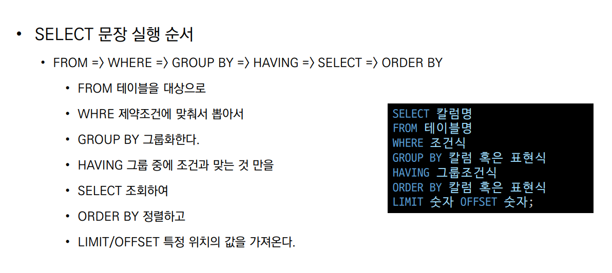

### 기본 함수와 연산

- 문자열 함수
  -  SUBSTR(문자열, start, length) : 문자열 자르기
    - 시작 인덱스는 1, 마지막 인덱스는 -1
  - TRIM(문자열), LTRIM(문자열), RTIM(문자열) : 문자열 공백 제거
  - LENGTH(문자열) : 문자열 길이
  - REPLACE(문자열, 패턴, 변경값) : 패턴에 일치하는 부분을 변경
  - UPPER(문자열), LOWER(문자열) : 대소문자 변경
  - • || : 문자열 합치기(concatenation)
- 숫자 함수
  - ABS(숫자) : 절대 값
  - • SIGN(숫자) : 부호 (양수 1, 음수 -1, 0 0)
  - • MOD(숫자1, 숫자2) : 숫자1을 숫자2로 나눈 나머지
  - CEIL(숫자), FLOOR(숫자), ROUND(숫자, 자리) : 올림, 내림, 반올림
  - POWER(숫자1, 숫자2) : 숫자1의 숫자2 제곱
  - SQRT(숫자) : 제곱근
- 산술 연산자 : • +, -, *, /와 같은 산술 연산자와 우선 순위를 지정하는 () 기호를 연산에 활용할 수 있음

### GROUP BY

- Aggregate function (집계 함수) 다시보기
  - 값 집합에 대한 계산을 수행하고 단일 값을 반환, 여러 행으로부터 하나의 결괏값을 반환하는 함수
  - SELECT 구문에서만 사용됨
  - ex) 테이블 전체 행 수를 구하는 COUNT(*), age 컬럼 전체 평균 값을 구하는 AVG(age) 
- ALIAS
  - 칼럼명이나 테이블명이 너무 길거나 다른 명칭으로 확인하고 싶을 때는 ALIAS를 활용
  -  AS를 생략하여 공백으로 표현할 수 있음
  - 별칭에 공백, 특수문자 등이 있는 경우 따옴표로 묶어서 표기
- GROUP BY
  - • SELECT 문의 optional 절
  - 행 집합에서 요약 행 집합을 만듦
  - 선택된 행 그룹을 하나 이상의 열 값으로 요약 행으로 만듦
  - 문장에 WHERE 절이 포함된 경우 **반드시 WHERE 절 뒤에** 작성해야 함
- HAVING
  - 집계함수는 WHERE 절의 조건식에서는 사용할 수 없음(WHERE로 처리하는 것이 GROUP BY 그룹화보다 순서상 앞서 있기 때문)
  - 집계 결과에서 조건에 맞는 값을 따로 활용하기 위해서 HAVING을 활용

