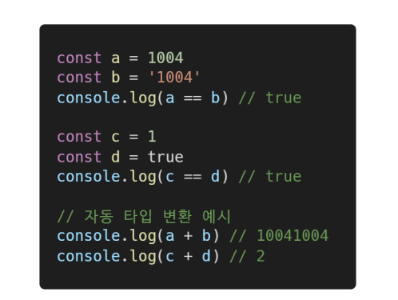
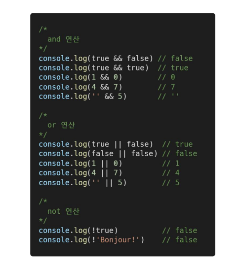
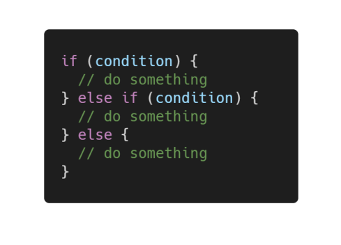
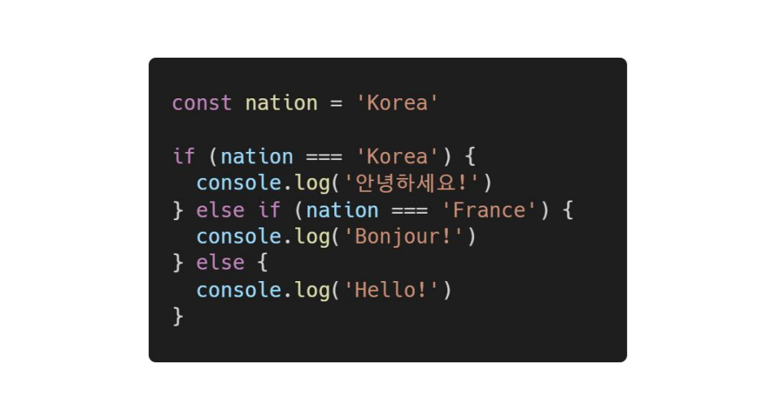
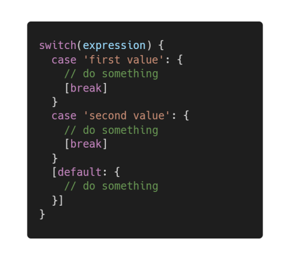
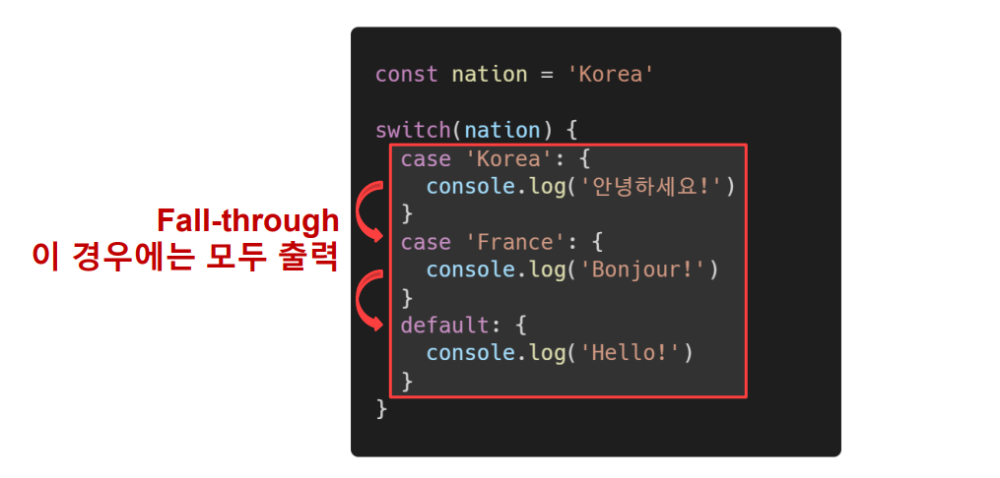
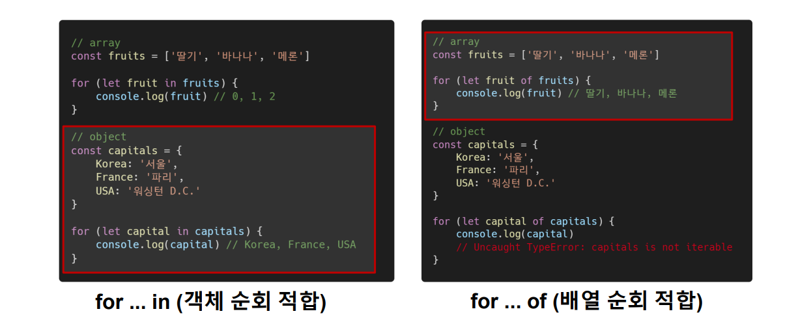
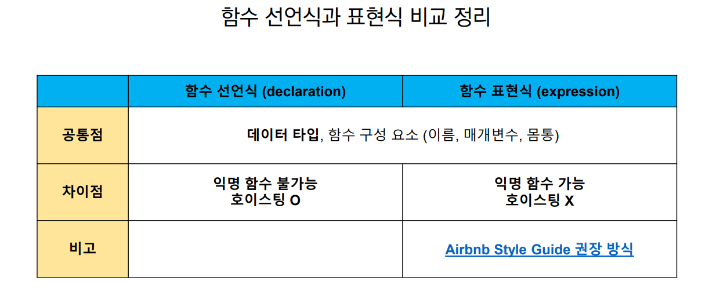
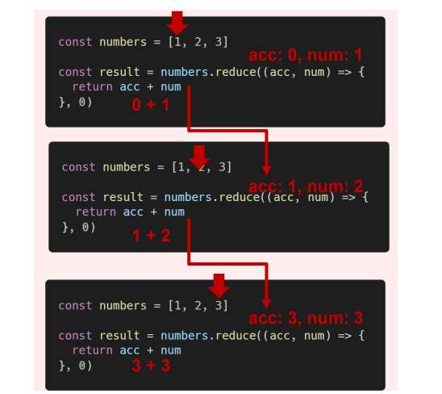

#### ECMA Script

코딩 스타일 가이드

- 코딩 스타일의 핵심은 합의된 원칙과 일관성
  - 절대적인 하나의 정답은 없으며, 상황에 맞게 원칙을 정하고 일관성 있게 사용하는 것이 중요
- 코딩 스타일은 코드의 품질에 직결되는 중요한 요소
  - 코드의 가독성, 유집수 또는 팀원과의 커뮤니케이션 등 개발 과정 전체에 영향을 끼침


## 변수와 식별자

- 식별자(identifier)는 변수를 구분할 수 있는 변수명을 말함
- 식별자는 반드시 문자, 달러($) 또는 밑줄(_)로 시작
- 대소문자를 구분하며, 클래스명 외에는 모두 소문자로 시작
- 예약어(for if function 등) 사용 불가능

(참고)

```javascript
let foo				// 선언
console.log(foo)	// undifined

foo = 11 			// 할당
console.log(foo)	// 11

let var = 0			// 선언 + 할당
console.log(bar)	// 0
```

- 선언 (Declaration)
  - 변수를 생성하는 행위 또는 시점
- 할당 (Assignment)
  - 선언된 변수에 값을 저장하는 행위 또는 시점
- 초기화 (Initialization)
  - 선언된 변수에 처음으로 값을 저장하는 행위 또는 시점


#### let, const

let (재할당 가능, 재선언 불가능)

```javascript
let number = 10			// 1. 선언 및 초기값 할당
number = 10				// 2. 재할당
console.log(number)		// 3. 10
```

```javascript
let number = 10			// 1. 선언 및 초기값 할당
let number = 50			// 2. 재선언 불가능
// Uncaught SyntaxError
	:Identifier 'number' has already been declared
```


const (재할당 불가능, 재선언 불가능)

```javascript
const number = 10		// 1. 선언 및 초기값 할당
numbers = 10			// 2. 재할당 불가능
// Uncaught TypeError
//	:Assignment to constant veriable.
```

```javascript
const number = 10			// 1. 선언 및 초기값 할당
const number = 50			// 2. 재선언 불가능
// Uncaught SyntaxError
	:Identifier 'number' has already been declared
```


블록 스코프* (block scope)

- if, for, 함수 등의 중괄호 내부를 가리킴
- 블록 스코프를 가지는 변수는 블록 바깥에서 접근 불가능


#### var

- var로 선언한 변수는 재선언 및 재할당 모두 가능
- ES6 이전에 변수를 선언할 때 사용되던 키워드
- 호이스팅*되는 특성으로 인해 예기치 못한 문제 발생 가능
  - 따라서 ES6 이후부터는 var 대신 const와 let을 사용하는 것을 권장
- 함수 스코프*
  - 함수의 중괄호 내부를 카리킴
  - 함수 스코프를 가지는 변수는 함수 바깥에서 접근 불가능


#### 호이스팅

-  호이스팅 (hoisting)
  - 변수를 선언 이전에 참조할 수 있는 현상
  - 변수 선언 이전의 위치에서 접근 시 undefined를 반환
- 자바스크립트는 모든 선언을 호이스팅한다.
- 즉, var, let, const 모두 호이스팅이 발생하지만, var는 선언과 초기화가 동시에 발생 하여 일시적 사각지대가 존재하지 않는다.


## 데이터 타입

- 자바스크립트의 모든 값은 특정한 데이터 타입을 가짐
- 크게 원시 타입(Primitice type)과 참조 타입(Reference type)으로 분류됨


### 원시 타입(Primitice type)

- 객체(object)가 아닌 기본 타입
- 변수에 해당 타입의 값이 담김
- 다른 변수에 복사할 때 실제 값이 복사됨.


### 참조 타입(Reference type)

- 객체 (object) 타입의 자료형
- 변수에 해당 객체의 참조 값이 담김
- 다른 변수에 복사할 때 참조 값이 복사됨


### 숫자 (Number) 타입

- 정수, 실수 구분 없는 하나의 숫자 타입
- 부동소수점 형식을 따름
  - (참고) NaN (Not-A-Number) : 계산 불가능한 경우 반환되는 값


### 문자열 (String) 타입

- 텍스트 데이터를 나타내는 타입
- 16비트 유니코드 문자의 집합
- 작은따옴표 또는 큰따옴표 모두 가능
- 템플릿 리터럴 (Template Literal)
  - ES6부터 지원
  - 따옴표 대신 backtick(` `)으로 표현
  -  ${ expression } 형태로 표현식 삽입 가능


### undefined

- 변수의 값이 없음을 나타내는 데이터 타입
- 변수 선언 이후 직접 값을 할당하지 않으면, 자동으로 undefined가 할당됨

```javascript
let firstName
console.log(firstName)	// undefined
```


### null

- 변수의 값이 없음을 의도적으로 표현할 때 사용하는 데이터 타입
- (참고) null 타입과 typeof 연산자*
  - typeof 연산자*: 자료형 평가를 위한 연산자
  - null 타입은 ECMA 명세의 원시 타입의 정의에 따라 원시 타입에 속하지만, typeof 연산자의 결과는 객체(object)로 표현됨 [참고 자료](https://2ality.com/2013/10/typeof-null.html)


### Boolean

- 논리적 참 또는 거짓을 나타내는 타입
- true 또는 false로 표현
- 조건문 또는 반복문*에서 유용하게 사용
  - (참고) 조건문 또는 반복문에서 boolean이 아닌 데이터 타입은 [자동 형변환 규칙](https://tc39.es/ecma262/#sec-type-conversion)에 따라 true 또는 false로 변 환됨


## 연산자

### 할당 연산자

- 오른쪽에 있는 피연산자의 평가 결과를 왼쪽 피연산자에 할당하는 연산자
-  다양한 연산에 대한 단축 연산자 지원
- (참고) Increment 및 Decrement 연산자*
  - Increment(++): 피연산자의 값을 1 증가시키는 연산자
  - Decrement(--): 피연산자의 값을 1 감소시키는 연산자
  - 존재는 하지만 '+=' 또는 '-='같이 더 분명한 표현하는것이 권장됨.


### 비교 연산자

- 피연산자를 비교하고 결과값을 boolean으로 반환하는 연산자
-  문자열은 유니코드 값을 사용하며 표준 사전 순서를 기반으로 비교
  - 알파벳끼리 비교할 경우 알페벳 순서상 후순위가 소문자보다 대문자가 더 크다.


### 동등 비교 연산자 (==)

- 두 피연산자가 같은 값으로 평가되는지 비교 후 boolean 값을 반환
- 비교할 때 [암묵적 타입 변환](https://262.ecma-international.org/5.1/#sec-11.9.3)을 통해 타입을 일치시킨 후 같은 값인지 비교
- 두 피연산자가 모두 객체일 경우 메모리의 같은 객체를 바라보는지 판별
- 예상치 못한 결과가 발생할 수 있으므로 특별한 경우를 제외하고 사용하지 않음




### 일치 비교 연산자 (===)

- 두 피연산자가 같은 값으로 평가되는지 비교 후 boolean 값을 반환
- [엄격한 비교](https://262.ecma-international.org/5.1/#sec-11.9.6)가 이뤄지며 암묵적 타입 변환이 발생하지 않음
  - 엄격한 비교*: 두 비교 대상의 타입과 값 모두 같은지 비교


### 논리 연산자

- 세 가지 논리 연산자로 구성
  - • and 연산은 ‘&&’ 연산자를 이용
  - or 연산은 ‘||’ 연산자를 이용
  - not 연산은 ‘!’ 연산자를 이용
- 단축 평가 지원
  - ex) false && true => false
  - ex) true || false => true




### 삼항 연산자 (Ternary Operator)

- 세 개의 피연산자를 사용하여 조건에 따라 값을 반환하는 연산자
- 가장 왼쪽의 조건식이 참이면 콜론(:) 앞의 값을 사용하고 그렇지 않으면 콜론(:) 뒤의 값을 사용
- 삼항 연산자의 결과 값이기 때문에 변수에 할당 가능
- (참고)[한 줄에 표기하는 것을 권장](https://github.com/airbnb/javascript#comparison--nested-ternaries)

```javascript
console.log(true ? 1 : 2)	// 1
console.log(false ? 1 : 2)	// 2

const result = Math.PI > 4 ? 'Yes' : 'No'
console.log(result)		// No
```


## 조건문

### 조건문의 종류와 특징

‘if’ statement

- 조건 표현식의 결과값을 Boolean 타입으로 변환 후 참/거짓을 판단


‘switch’ statement

- 조건 표현식의 결과값이 어느 값(case)에 해당하는지 판별
- (참고*) 주로 특정 변수의 값에 따라 조건을 분기할 때 활용 (조건이 많아질 경우 if문보다 가독성이 나을 수 있음)


if, else if, else

- 조건은 소괄호(condition) 안에 작성
- 실행할 코드는 중괄호{} 안에 작성
- 블록 스코프 생성



if statement 예시



switch statement

- 표현식(expression)의 결과값을 이용한 조건문
- 표현식의 결과값과 case문의 오른쪽 값을 비교
- break 및 default문은 [선택적]으로 사용 가능
- break문을 만나거나 default문을 실행할 때까지 다음 조건문 실행






## 반복문

반복문의 종류

- while
  - 조건문이 참(true)인 동안 반복 시행
  - 조건은 소괄호 안에 작성
  -  실행할 코드는 중괄호 안에 작성
  - 블록 스코프 생성


```javascript
//예시
let i = 0

while (i < 6) {
    console.log(i) // 0, 1, 2, 3, 4, 5
    i += 1
}
```


- for
  - 세미콜론(;)으로 구분되는 세 부분으로 구성
  - initialization - 최초 반복문 진입 시 1회만 실행되는 부분
  - condition - 매 반복 시행 전 평가되는 부분
  - expression - 매 반복 시행 이후 평가되는 부분
  - 블록 스코프 생성

```javascript
for (let i = 0; i <6; i++) {
	console.log(i) // 0, 1, 2, 3, 4, 5
}

// 1. 반복문 진입 및 변수 i 선언
// 2. 조건문 평가 후 코드 블럭 실행
// 3. 코드 블록 실행 이후 i 값 
// 2, 3 반복
```


- for ... in
  - 주로 객체(object)의 속성들을 순회할 때 사용
  - 배열도 순회 가능하지만 인덱스 순으로 순회한다는 보장이 없으므로 권장하지 않음
  - 실행할 코드는 중괄호 안에 작성
  - 블록 스코프 생성

```javascript
// object(객체) => key-value로 이루어진 자료구조 (객체 챕터에서 학습 예정)
const capitals = {
	korea: 'seoul',
    france: 'paris',
    USA: 'washington D.C.'
}
for (let capital in capitas) {
    console.log(capital) // korea, france, USA
}
```


- for...of
  - 반복 가능한(iterable)* 객체를 순회하며 값을 꺼낼 때 사용
    - 반복 가능한(iterable) 객체*의 종류: Array, Map, Set, String 등
  - 실행할 코드는 중괄호 안에 작성
  - 블록 스코프 생성

```javascript
const fruits = ['딸기', '바나나', '메론']
for (let fruit of fruits) {
    fruit = fruit + '!'
    console.log(fruit)
}
```





## 함수

- 참조 타입 중 하나로써 function 타입에 속함
- JavaScript에서 함수를 정의하는 방법은 주로 2가지(함수 선언식 (function declaration), 함수 표현식 (function expression))로 구분
- (참고) JavaScript의 함수는 [일급 객체(First-class citizen)](https://developer.mozilla.org/ko/docs/Glossary/First-class_Function)에 해당
  - 일급객체 : 변수에 할당 가능하고 함수의 매개변수로 전달 가능하며 함수의 반환 값으로 사용가능한 객체를 의미함.


### 함수의 정의

함수의 이름과 함께 정의하는 방식

함수의 이름 (name), 매개변수 (args), 함수 body (중괄호 내부) 3부분으로 구성

```javascript
//ex)
function add(num1, num2) {
return num1 + num2
}
add(1, 2)
```


### 함수 표현식(function expression)

- 함수를 표현식* 내에서 정의하는 방식
  -  표현식*: 어떤 하나의 값으로 결정되는 코드의 단위
- 함수의 이름을 생략하고 익명 함수*로 정의 가능
  - 익명 함수*(anonymous function): 이름이 없는 함수
  - 익명 함수는 함수 표현식에서만 가능
- 함수의 이름, 매개변수, 몸통 3부분으로 구성되어있지만 함수의 이름은 경우에 따라 생략이 가능함.


기본인자(default arguments) - 인자 작성 시 ‘=’ 문자 뒤 기본 인자 선언 가능

```javascript
const greeting = function (name = 'Anonymous') {
return `Hi ${name}`
}
greeting() // Hi Anonymous
```


### 매개 변수와 인자의 개수 불일치 허용

- 매개 변수보다 인자의 개수가 많을 경우, 인자에서 앞에서부터 매개 변수의 개수 만큼의 인자의 개수만을 사용

```javascript
const noArgs = function () {
return 0
}
noArgs(1, 2, 3) // 0
const twoArgs = function (arg1, arg2) {
return [arg1, arg2]
}
twoArgs(1, 2, 3) // [1, 2]
```

- 매개 변수보다 인자의 개수가 적을 경우, 인자가 없는 경우 undefined을 대입하여 동작함.

```javascript
const threeArgs = function (arg1, arg2, arg3) {
return [arg1, arg2, arg3]
}
threeArgs() // [undefined, undefined, undefined]
threeArgs(1) // [1, undefined, undefined]
threeArgs(1, 2) // [1, 2, undefined]
```


### Rest Parameter

- rest parameter(…)를 사용하면 함수가 정해지지 않은 수의 매개변수를 배열로 받음 (python 의 *args 와 유사)
  - 만약 rest parameter로 처리한 매개변수에 인자가 넘어오지 않을 경우에는, 빈 배열로 처리

```javascript
const restOpr = function (arg1, arg2, ...restArgs) {
	return [arg1, arg2, restArgs]
}
restArgs(1, 2, 3, 4, 5) // [1, 2, [3, 4, 5]]
restArgs(1, 2) // [1, 2, []]
```


#### Spread operator

- spread operator(…)를 사용하면 배열 인자를 전개하여 전달 가능.

```javascript
const spreadOpr = function (arg1, arg2, arg3) {
	return arg1 + arg2 + arg3
}
const numbers = [1, 2, 3]
spreadOpr(...numbers) // 6
```




#### 함수의 타입

- 선언식 함수와 표현식 함수 모두 타입은 function으로 동일

```javascript
// 함수 표현식
const add = function (args) { }

// 함수 선언식
function sub(args) { }
console.log(typeof add) // function
console.log(typeof sub) // function
```


#### 호이스팅(hoisting) - 함수 선언식

- 함수 선언식으로 선언한 함수는 var로 정의한 변수처럼 hoisting 발생
- 함수 호출 이후에 선언 해도 동작


#### 호이스팅(hoisting) - 함수 표현식

- 반면 함수 표현식으로 선언한 함수는 함수 정의 전에 호출 시 에러 발생
-  함수 표현식으로 정의된 함수는 변수로 평가되어 변수의 scope 규칙을 따름
- (참고) 함수 표현식을 var 키워드로 작성한 경우, 변수가 선언 전 undefined 로 초기화 되어 다른 에러가 발생


### 화살표 함수 (Arrow Function)

- 함수를 비교적 간결하게 정의할 수 있는 문법
- function 키워드 생략 가능
- 함수의 매개변수가 단 하나 뿐이라면, ‘( )’ 도 생략 가능
- 함수 몸통이 표현식 하나라면 ‘{ }’과 return도 생략 가능
- 기존 function 키워드 사용 방식과의 차이점은 후반부 this 키워드를 학습하고 다시 설명

```javascript
const arrow1 = function (name) {
return `hello, ${name}`
}
// 1. function 키워드 삭제
const arrow2 = (name) => { return `hello, ${name}` }
// 2. 매개변수가 1개일 경우에만 ( ) 생략 가능
const arrow3 = name => { return `hello, ${name}` }
// 3. 함수 바디가 return을 포함한 표현식 1개일 경우에 { } & return 삭제
가능
const arrow4 = name => `hello, ${name}`
```


### 문자열 (String)

### 문자열 관련 주요 메서드 

#### includes 

표현법  - string.includes(value) 

- 문자열에 value가 존재하는지 판별 후 참 또는 거짓 반환

```javascript
const str = 'a santa at nasa’
str.includes('santa') // true
str.includes('asan') // false
```

#### split

표현법 - string.split(value)

- value가 없을 경우, 기존 문자열을 배열에 담아 반환
- value가 빈 문자열일 경우 각 문자로 나눈 배열을 반환
- value가 기타 문자열일 경우, 해당 문자열로 나눈 배열을 반환

```javascript
const str = 'a cup’
str.split() // ['a cup’]
str.split('') // ['a', ' ', 'c', 'u', 'p']
str.split(' ') // ['a', 'cup']
```

#### replace

string.replace(from, to)

- 문자열에 from 값이 존재할 경우, 1개만 to 값으로 교체하여 반환

string.replaceAll(from, to)

- 문자열에 from 값이 존재할 경우, 모두 to 값으로 교체하여 반환

```javascript
const str = 'a b c d'
str.replace(' ', '-') // 'a-b c d'
str.replaceAll(' ', '-') // 'a-b-c-d'
```

#### trim

string.trim()

- 문자열 시작과 끝의 모든 공백문자(스페이스, 탭, 엔터 등)를 제거한 문자열 반환

string.trimStart()

- 문자열 시작의 공백문자(스페이스, 탭, 엔터 등)를 제거한 문자열 반환

string.trimEnd()

- 문자열 끝의 공백문자(스페이스, 탭, 엔터 등)를 제거한 문자열 반환

```javascript
const str = ' hello '
str.trim() // 'hello'
str.trimStart() // 'hello '
str.trimEnd() // ' hello'
```


### 배열

배열의 정의와 특징

- 키와 속성들을 담고 있는 참조 타입의 객체(object) 
- 순서를 보장하는 특징이 있음
- 주로 대괄호를 이용하여 생성하고, 0을 포함한 양의 정수 인덱스로 특정 값에 접근 가능
- 배열의 길이는 array.length 형태로 접근 가능
  - (참고) 배열의 마지막 원소는 array.length – 1로 접근

```javascript
const numbers = [1, 2, 3, 4, 5]

console.log(numbers[0])		// 1
console.log(numbers[-1])	// undefined
console.log(numberslength)	// 5

const numbers = [1, 2, 3, 4, 5]

console.log(numbers[numbers.length - 1])	// 5
console.log(numbers[numbers.length - 2])	// 4
console.log(numbers[numbers.length - 3])	// 3
console.log(numbers[numbers.length - 4])	// 2
console.log(numbers[numbers.length - 5])	// 1
```


### 배열 관련 주요 메서드 - 기본편 (기본 배열 조작)

[참고1](https://developer.mozilla.org/ko/docs/Web/JavaScript/Reference/Global_Objects/Array#%EC%9D%B8%EC%8A%A4%ED%84%B4%EC%8A%A4_%EB%A9%94%EC%84%9C%EB%93%9C) [참고2](https://tc39.es/ecma262/#sec-properties-of-the-array-constructor) (#sec-properties-of-the-array-constructor) 

#### reverse

표현법 - array.reverse()

- 원본 배열의 요소들의 순서를 반대로 정렬

```javascript
const numbers = [1, 2, 3, 4, 5]
nubmers.reverse()
console.log(numbers)	// [5, 4, 3, 2, 1]
```


####  push & pop

표현법 - array.push()

- 배열의 가장 뒤에 요소 추가

표현법 - array.pop()

- 배열의 마지막 요소 제거

```javascript
const numbers = [1, 2, 3, 4, 5]

nubmers.push(100)
console.log(numbers)	// [1, 2, 3, 4, 5, 100]

nubmers.pop()
console.log(numbers)	// [1, 2, 3, 4, 5]
```


#### unshift & shift 

표현법 - array.unshift()

- 배열의 가장 앞에 요소 추가

표현법 - array.shift()

- 배열의 첫번째 요소 제거

```javascript
const numbers = [1, 2, 3, 4, 5]

nubmers.unshift(100)
console.log(numbers)	// [100, 1, 2, 3, 4, 5]

nubmers.shift()
console.log(numbers)	// [1, 2, 3, 4, 5]
```


#### includes

표현법 - array.includes(value)

- 배열에 특정 값이 존재하는지 판별 후 참 또는 거짓 반환

```javascript
const numbers = [1, 2, 3, 4, 5]

console.log(numbers.includes(1))	// true

console.log(numbers.includes(100))	// false
```


####  indexOf

표현법 - array.indexOf(value)

- 배열에 특정 값이 존재하는지 확인 후 가장 첫 번째로 찾은 요소의 인덱스 반환
- 만약 해당 값이 없을 경우 -1 반환

```javascript
const numbers = [1, 2, 3, 4, 5]
let result

result = numbers.indexOf(3)		//2
console.log(result)

result = numbers.indexOf(100)	//-1
console.log(result)
```


#### join

표현법 - array.join([separator])

- 배열의 모든 요소를 연결하여 반환
-  separator(구분자)는 선택적으로 지정 가능하며, **생략 시 쉼표를 기본 값**으로 사용

```javascript
const numbers = [1, 2, 3, 4, 5]
let result

result = numbers.join()				// 1,2,3,4,5
console.log(result)

result = numbers.join('')			// 12345
console.log(result)

result = numbers.join(' ')			// 1 2 3 4 5
console.log(result)

result = numbers.join('-')			// 1-2-3-4-5
console.log(result)
```


### Spread operator

spread operator(…)를 사용하면 배열 내부에서 배열 전개 가능 (ES5까지는 Array.concat() 메서드를 사용.)

얕은 복사에 활용 가능

```javascript
const array = [1, 2, 3]
const newArray = [0, ...array, 4]
console.log(newArray) // [0, 1, 2, 3, 4]
```


### 배열 관련 주요 메서드 – 심화편 (Array Helper Methods) 

- 배열을 순회하며 특정 로직을 수행하는 메서드
- 메서드 호출 시 인자로 callback 함수를 받는 것이 특징

#### forEach

표현법 - array.forEach(callback(element[, index[,array]]))

- 배열의 각 요소에 대해 콜백 함수를 한 번씩 실행
- 콜백 함수는 3가지 매개변수로 구성
  - element: 배열의 요소
  - index: 배열 요소의 인덱스
  - array: 배열 자체
- 반환 값(return)이 없는 메서드

```javascript
array.forEach((element, index, array) => {
    //do something
})

const fruits = ['딸기', '수박', '사과', '체리']

fruits.forEach((fruit, index) => {
    console.log(fruit, index)
    // 딸기 0
    // 수박 1
    // 사과 2
    // 체리 3
})
```


#### map

표현법 - array.map(callback(element[, index[, array]]))

- 배열의 각 요소에 대해 콜백 함수를 한 번씩 실행
- 콜백 함수의 반환 값을 요소로 하는 새로운 배열 반환
- 기존 배열 전체를 다른 형태로 바꿀 때 유용

```javascript
array.map((element, index, array) => {
    //do something
})

const numbers = [1, 2, 3, 4, 5]

const doubleNums = numbers.map((num) => {
	return num * 2
})

consol.log(doubleNums)	// [2, 4, 6, 8, 10]
```


#### filter

표현법 - array.filter(callback(element[, index[, array]]))

- 배열의 각 요소에 대해 콜백 함수를 한 번씩 실행
- 콜백 함수의 반환 값이 참인 요소들만 모아서 새로운 배열을 반환
- 기존 배열의 요소들을 필터링할 때 유용

```javascript
array.filter((element, index, array) => {
    //do something
})

const numbers = [1, 2, 3, 4, 5]

const oddNums = numbers.filter((num, index) => {
	return num % 2
})

consol.log(doubleNums)	// [1, 3, 5]
```


#### reduce

표현법 - array.reduce(callback(acc, element, [index[, array]])[, initialValue])

- 배열의 각 요소에 대해 콜백 함수를 한 번씩 실행
- 콜백 함수의 반환 값들을 하나의 값(acc)에 누적 후 반환
- reduce 메서드의 주요 매개변수
  - acc : 이전 callback 함수의 반환 값이 누적되는 변수
  - initialValue(optional) : • 최초 callback 함수 호출 시 acc에 할당되는 값, default 값은 배열의 첫 번째 값
- (참고) 빈 배열의 경우 initialValue를 제공하지 않으면 에러 발생

```
array.reduce((acc, element, index, array) => {
    //do something
}, initialValue)

const numbers = [1, 2, 3]

const result = numbers.reduce((acc, num) => {
	return acc + num
}, 0)

consol.log(doubleNums)	// 6
```




#### find

표현법 - array.find(callback(element[, index[, array]]))

- 배열의 각 요소에 대해 콜백 함수를 한 번씩 실행
- 콜백 함수의 반환 값이 참이면, 조건을 만족하는 첫번째 요소를 반환
- 찾는 값이 배열에 없으면 undefined 반환

```javascript
array.find((element, index, array)) {
	// do something
}

const avengers = [
	{ name: 'Tony Stark', age: 45},
    { name: 'Steve Rogers', age: 32},
    { name: 'Thor', age: 40 },
]

const result = avengers.find((avenger) =>{
    return avenger.name === 'Tony Stark'
})

console.log(result) // {name: "Tony Stark", age: 45}
```


#### some

표현법 - array.some(callback(element[, index[, array]]))

- 배열의 요소 중 하나라도 주어진 판별 함수를 통과하면 참을 반환
- 모든 요소가 통과하지 못하면 거짓 반환
- (참고) 빈 배열은 항상 거짓 반환

```javascript
array.some((element, index, array) => {
    // do someting
})

const numbers = [1, 3, 5, 7, 9]

const hasEvenNumber = numbers.some((num) => {
    return num % 2 === 0
})
console.log(hasEvenNumber)	// false

const hasEvenNumber = numbers.some((num) => {
    return num % 2
})
console.log(hasEvenNumber)	// true
```


#### every

표현법 - array.every(callback(element[, index[, array]]))

- 배열의 모든 요소가 주어진 판별 함수를 통과하면 참을 반환
- 하나의 요소라도 통과하지 못하면 거짓 반환
- (참고) 빈 배열은 항상 참 반환

```javascript
array.every((element, index, array) => {
    // do someting
})

const numbers = [2, 4, 6, 8, 10]

const isEvenNumberEven = numbers.every((num) => {
    return num % 2 === 0
})
console.log(hasEvenNumber)	// true

const isEvenNumberOdd = numbers.every((num) => {
    return num % 2
})
console.log(hasEvenNumber)	// false
```


### 객체 (Objects)

객체 정의와 특징

- 객체는 속성(property)의 집합이며, 중괄호 내부에 key와 value의 쌍으로 표현
-  key는 문자열 타입*만 가능
  - (참고) key 이름에 띄어쓰기 등의 구분자가 있으면 따옴표로 묶어서 표현
- value는 모든 타입(함수포함) 가능
- 객체 요소 접근은 점 또는 대괄호로 가능
  - (참고) key 이름에 띄어쓰기 같은 구분자가 있으면 대괄호 접근만 가능

```javascript
const me = {
    name: 'jack',
    phoneNumber: '01012345678',
    'samsung products': {
        buds: 'Galaxy Buds pro',
        galaxy: 'Galaxy s20’,
    },
}
console.log(me.name)
console.log(me.phoneNumber)
console.log(me['samsung products'])
console.log(me['samsung products'].buds)
```

- 메서드는 객체의 속성이 참조하는 함수
- 객체.메서드명() 으로 호출 가능
- 메서드 내부에서는 this 키워드가 객체를 의미함

```javascript
const me = {
    firstName: 'John',
    lastName: 'Doe’
    ,
    getFullName: function () {
        return this.firstName + this.lastName
    }
}
```


#### 객체 관련 ES6 문법 익히기

ES6에 새로 도입된 문법들로 객체 생성 및 조작에 유용하게 사용 가능

- 속성명 축약
- 메서드명 축약
- 계산된 속성명 사용하기
- 구조 분해 할당*
  - (참고) 구조 분해 할당은 [배열도 가능함](https://developer.mozilla.org/ko/docs/Web/JavaScript/Reference/Operators/Destructuring_assignment#%EB%B0%B0%EC%97%B4_%EA%B5%AC%EC%A1%B0_%EB%B6%84%ED%95%B4)
- 객체 전개 구문(Spread Operator)


#### [JSON (JavaScript Object Notation)](https://www.ecma-international.org/publications-and-standards/standards/ecma-404/)

- key-value쌍의 형태로 데이터를 표기하는 언어 독립적 표준 포맷
- 자바스크립트의 객체와 유사하게 생겼으나 실제로는 문자열 타입
  - 따라서 JS의 객체로써 조작하기 위해서는 구문 분석(parsing)이 필수
- 자바스크립트에서는 JSON을 조작하기 위한 두 가지 내장 메서드를 제공
  - JSON.parse() : JSON => 자바스크립트 객체
  - JSON.stringify() : 자바스크립트 객체 => JSON
