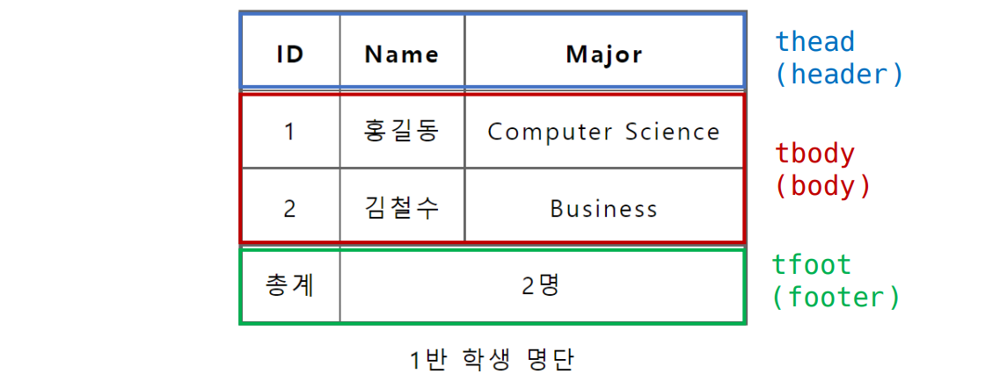
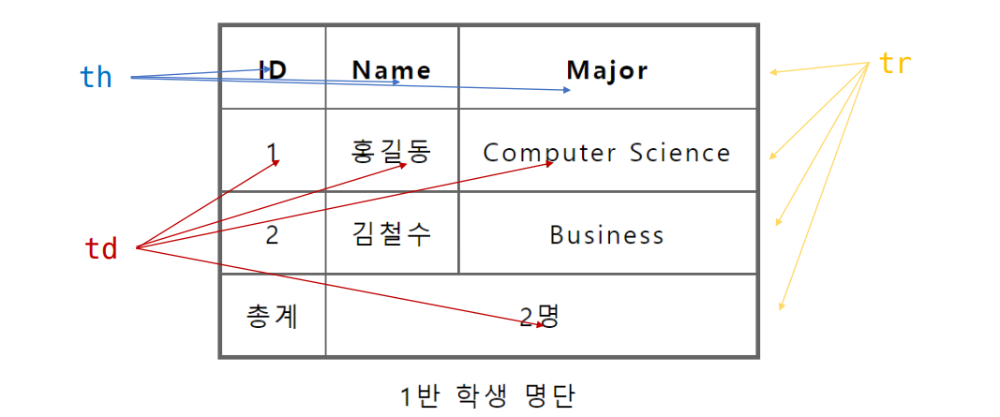
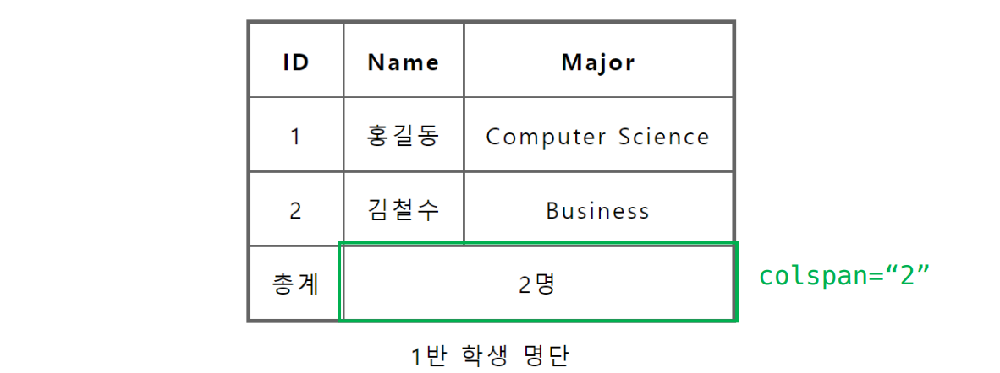
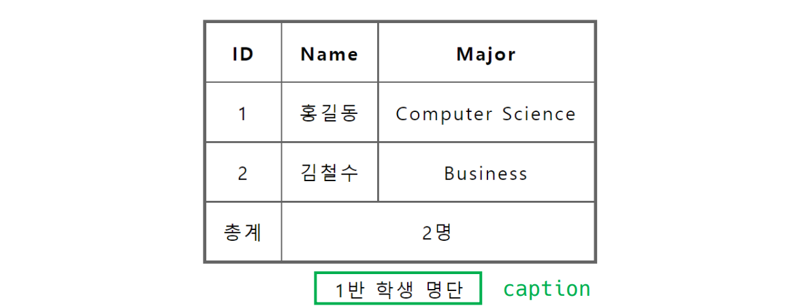
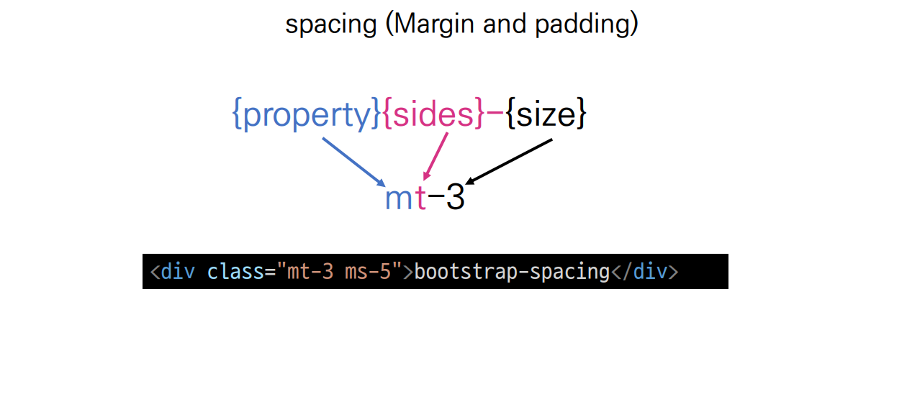
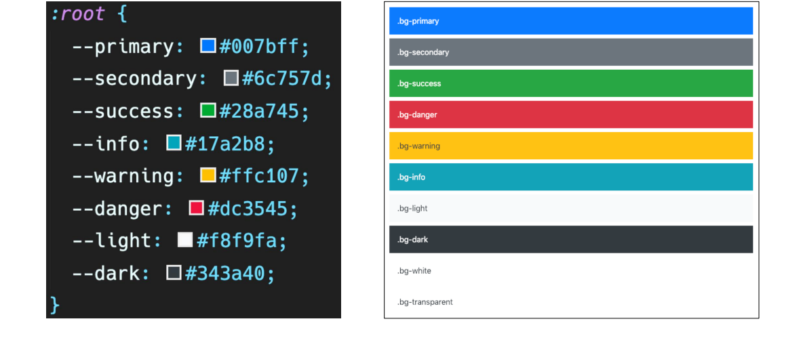
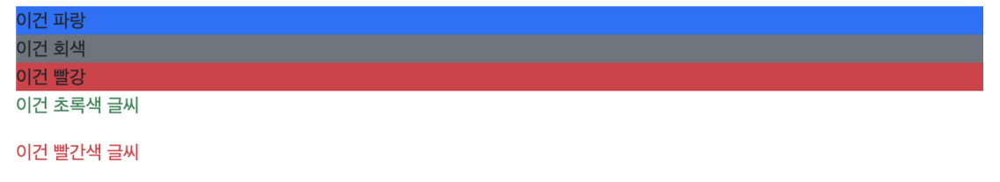

### HTML 문서 구조화

- table의 각 영역을 명시하기 위해 \<thead> \<tbody> \<tfoot> 요소를 활용



- \<tr>으로 가로 줄을 구성하고 내부에는 \<th> 혹은 \<td>로 셀을 구성



- colspan, rowspan 속성을 활용하여 셀 병합



- \<caption>을 통해 표 설명 또는 제목을 나타냄



- table 태그 기본 구성
  - thead
    - tr > th
  - tbody
    - tr > td
  - tfoot
    - tr > td
  - caption


### form

- \<form>은 정보(데이터)를 서버에 제출하기 위해 사용하는 태그
- \<form> 기본 속성
  - action : form을 처리할 서버의 URL(데이터를 보낼 곳)
  - method : form을 제출할 때 사용할 HTTP 메서드 (GET 혹은 POST)
  - enctype : method가 post인 경우 데이터의 유형
    -  application/x-www-form-urlencoded : 기본값
    - multipart/form-data : 파일 전송시 (input type이 file인 경우)


### input

- 다양한 타입을 가지는 입력 데이터 유형과 위젝이 제공됨
- \<input> 대표적인 속성
  - name : form control에 적용되는 이름 (이름/값 페어로 전송됨)
  - value : form control에 적용되는 값 (이름/값 페어로 전송됨)
  - required. readonly, autofocus, autocomplete, disabled 등


#### input label

- label을 클릭하여 input 자체의 초점을 맞추거나 활성화 시킬 수 있음
  - 사용자는 선택할 수 있는 영역이 늘어나 웹 / 모바일 (터치) 환경에서 편하게 사용할 수 있음
  - label과 input 입력의 관계가 시각적 뿐만 아니라 화면리더기에서도 label을 읽어 쉽게 내용을 확인 할 수 있도록 함
- \<input>에 id 속성을, \<label>에는  for 속성을 활용하여 상호 연관을 시킴


### input 유형 - 일반

- 일반적으로 입력을 받기 위하여 제공되며 타입별로 HTML 기본 검증 혹은 추가 속성을 활용할 수 있음
  - text : 일반 텍스트 입력
  - password : 입력 시 값이 보이지 않고 문자를 특수기호(*)로 표현
  - email : 이메일 형식이 아닌 경우 form 제출 불가
  - number : min, max, step 속성을 활용항 숫자 범위 설정 가능
  - file : accept 속성을 활용하여 파일 타입 지정 가능


### input 유형 - 항목 중 선택

- 일반적으로 label 태그와 함께 사용하여 선택 항목을 작성함
- 동일 항목에 대하여 name을 지정하고 선택된 항목에 대한 value를 지정해야 함
  - checkbox : 다중 선택
  - radio : 단일 선택


#### input 유형 - 기타

- 다양한 종류의 input을 위한 picker를 제공
  - color : color picker
  - date : date picker
- hidden input을 활용하여 사용자 입력을 받지 않고 서버에 전송되어야 하는 값을 설정
  - hidden : 사용자에게 보이지 않는 input


## Bootstrap

### CDN

Content Delivery(Distribution) Network

- 컨텐츠 (CSS, JS, Image, Text 등)을 효율적으로 전달하기 위해 여러 노드에 가진 네트워크에 데이터를 제공하는 시스템.
- 개별 end-user의 가까운 서버를 통해 빠르게 전달 가능(지리적 이점) 외부 서버를 활용함으로써 본인 서버의 부하가 적어짐


### spacing



- sides
  - m - margin
  - p - padding
- sides
  - t - top
  - b - bottom
  - s - start
  - e - end
  - x - left and right
  - y - top and bottom
  - blank - 4면 모두
- size
  - 0 - 0
  - 1 - 0.25rem
  - 2 - 0.5rem
  - 3 - 1rem
  - 4 - 1.5rem
  - 5 - 3rem
  - auto - 자동 설정, **블록 요소** 수평 중앙 정렬, 가로 가운데 정렬

- py-0

  ```css
  .py-0 {
  padding-top: 0 !important;
  padding-bottom: 0 !important;
  }
  ```


### Color




```html
<h2>Color</h2>
<div class="bg-primary">이건 파랑</div>
<div class="bg-secondary">이건 회색</div>
<div class="bg-danger">이건 빨강</div>
<p class="text-success">이건 초록색 글씨</p>
<p class="text-danger">이건 빨간색 글씨</p>
```

